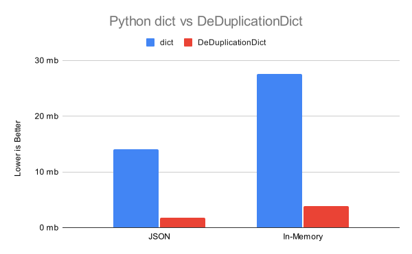

# DeDuplicationDict

[](https://badge.fury.io/py/deduplicationdict)
[](https://deduplicationdict.readthedocs.io/en/release/?badge=release)
[](https://badge.fury.io/py/deduplicationdict)
[](https://opensource.org/licenses/MPL-2.0)

[](https://github.com/Vivswan/DeDuplicationDict)

A dictionary that de-duplicates values.

A dictionary-like class that deduplicates values by storing them in a separate dictionary and replacing
them with their corresponding hash values. This class is particularly useful for large dictionaries with
repetitive entries, as it can save memory by storing values only once and substituting recurring values
with their hash representations.

This class supports nested structures by automatically converting nested dictionaries into
`DeDuplicationDict` instances. It also provides various conversion methods to convert between regular
dictionaries and `DeDuplicationDict` instances.

## Installation

```bash
pip install deduplicationdict
```

## Usage

```python
from deduplicationdict import DeDuplicationDict

# Create a new DeDuplicationDict instance
dedup_dict = DeDuplicationDict.from_dict({'a': [1, 2, 3], 'b': 2, 'c': [1, 2, 3]})
# or
dedup_dict = DeDuplicationDict(**{'a': [5, 6, 7], 'b': 2, 'c': [5, 6, 7]})

# Add a new duplicate key-value pair
dedup_dict['d'] = [1, 2, 3]
dedup_dict['e'] = [1, 2, 3]

# Print the dictionary
print(f"dedup_dict.to_dict(): {dedup_dict.to_dict()}")
# output: {'a': [5, 6, 7], 'b': 2, 'c': [5, 6, 7], 'd': [1, 2, 3], 'e': [1, 2, 3]}

# Print the deduplicated dictionary internal
print(f"dedup_dict.key_dict: {dedup_dict.key_dict}")
# output: {'a': '7511debb', 'b': '7c7ad8f0', 'c': '7511debb', 'd': 'f9343d7d', 'e': 'f9343d7d'}
print(f"dedup_dict.value_dict: {dedup_dict.value_dict}")
# output: {'7511debb': [5, 6, 7], '7c7ad8f0': 2, 'f9343d7d': [1, 2, 3]}

# Print the deduplicated dictionary
print(f"to_json_save_dict: {dedup_dict.to_json_save_dict()}")
# output: {'key_dict': {'a': '7511debb', 'b': '7c7ad8f0', 'c': '7511debb', 'd': 'f9343d7d', 'e': 'f9343d7d'}, 'value_dict': {'7511debb': [5, 6, 7], '7c7ad8f0': 2, 'f9343d7d': [1, 2, 3]}}
assert DeDuplicationDict.from_json_save_dict(dedup_dict.to_json_save_dict()).to_dict() == dedup_dict.to_dict()
```

## Results from Testing

| Method              | JSON Memory (MB) | In-Memory (MB) |
|:--------------------|:----------------:|:--------------:|
| `dict`              |    14.089 MB     |   27.542 MB    |
| `DeDuplicationDict` |    1.7906 MB     |    3.806 MB    |
|                     |                  |                |
| _Memory Saving_     |    **7.868x**    |   **7.235x**   |

[//]: # (![dict vs DeDuplicationDict]&#40;https://github.com/Vivswan/DeDuplicationDict/raw/release/docs/_static/dict_vs_DeDuplicationDict.svg&#41;)


## Documentation

The documentation for this project is hosted on [Read the Docs](https://deduplicationdict.readthedocs.io/en/release/).

## License

This project is licensed under the terms of the [Mozilla Public License 2.0](https://opensource.org/licenses/MPL-2.0).
